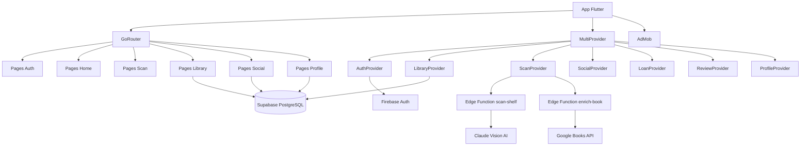

# ARCHITECTURE.md — BiblioShare

## 1. Informations generales

| Champ | Valeur |
|---|---|
| Nom du projet | BiblioShare |
| Version | 1.0.0 |
| Date de creation | 2026 |
| Derniere mise a jour | 2026-02-20 |
| Plateforme | iOS + Android (Flutter) |
| Backend Auth | Firebase (Auth) — projet `biblio-share-qdbtjz` |
| Backend DB | Supabase PostgreSQL — projet `osbcejhzxxpdtvbdwaaw` |
| Package | `com.only1cent.biblioshare` |
| Framework | Flutter + Dart (native code) |

---

## 2. Description du projet

**Objectif :** BiblioShare est une application mobile sociale de bibliotheque personnelle. Elle permet de scanner ses etageres avec l'IA (Claude Vision), gerer sa collection de livres, preter/emprunter entre amis, et partager des recommandations de lecture.

**Public cible :**
- Lecteurs souhaitant numeriser et gerer leur collection de livres
- Amis souhaitant se preter des livres et suivre les emprunts
- Passionnes de lecture cherchant a partager et recevoir des recommandations

**Fonctionnalites principales :**
- Scan d'etagere par photo avec reconnaissance IA (Claude Vision)
- Enrichissement automatique des livres via Google Books API
- Gestion de collection personnelle (ajout, edition, suppression)
- Systeme de pret/emprunt entre amis avec suivi de statut
- Recommandations de livres entre amis
- Avis et notes sur les livres (1-5 etoiles)
- Systeme d'amis (recherche, invitation par lien/SMS)
- Profils personnalises avec statistiques de lecture

---

## 3. Architecture technique

### Stack technique

| Couche | Technologie | Version |
|---|---|---|
| Framework | Flutter + Dart | SDK >=3.10.1 |
| State Management | Provider | 6.1.2 |
| Navigation | GoRouter | 14.8.1 |
| Authentification | Firebase Auth | 5.5.1 |
| Base de donnees | Supabase (PostgreSQL) | supabase_flutter 2.9.0 |
| Google Sign-In | google_sign_in | 6.2.2 |
| Apple Sign-In | sign_in_with_apple | 6.1.4 |
| Publicites | google_mobile_ads | 6.0.0 |
| Push notifications | firebase_messaging | 15.2.4 |
| Polices | Google Fonts (Merriweather) | 6.2.1 |
| Animations | flutter_animate | 4.5.2 |
| Images | image_picker | 1.2.1 |
| SVG | flutter_svg | 2.2.3 |
| Persistance locale | shared_preferences | 2.5.3 |
| Telephone | intl_phone_field | 3.2.0 |

### Diagramme d'architecture



### Dependances principales (pubspec.yaml)

Voir tableau Stack technique ci-dessus.

---

## 4. Structure des ecrans

### Pages Authentification (`lib/features/auth/screens/`)

| Ecran | Route | Description | Methodes auth |
|---|---|---|---|
| SplashScreen | `/` | Demarrage avec logo SVG + gradient, redirection auto selon AuthStatus | - |
| LoginScreen | `/login` | Connexion / Inscription | Google Sign-In, Apple Sign-In (iOS), Phone OTP, Anonyme |
| OtpVerificationScreen | `/otp` | Verification code OTP 6 chiffres | Phone OTP |
| OnboardingScreen | `/onboarding` | Onboarding 4 pages (bienvenue, langue, scan, social) | - |

### Pages Home (`lib/features/home/screens/`)

| Ecran | Route | Description | Widgets principaux | Actions cles | Navigation vers |
|---|---|---|---|---|---|
| HomeScreen | `/home` | Page d'accueil avec 4 onglets | TabBar (Library, Scanner, Social, Profile) | Navigation entre onglets | ScanScreen, BookDetail, Friends, Profile |

### Pages Scan (`lib/features/scan/screens/`)

| Ecran | Route | Description | Widgets principaux | Actions cles | Navigation vers |
|---|---|---|---|---|---|
| ScanScreen | `/scan` | Prise photo etagere | Camera/Gallery picker | Photo + analyse Claude Vision + enrichissement Google Books | ScanResultsScreen |
| ScanResultsScreen | `/scan/results` | Resultats du scan | Liste livres detectes, boutons confirmer/rejeter/editer | Confirmer/rejeter/editer livres, sauvegarder en bibliotheque | HomeScreen |

### Pages Library (`lib/features/library/screens/`)

| Ecran | Route | Description | Widgets principaux | Actions cles | Navigation vers |
|---|---|---|---|---|---|
| BookDetailScreen | `/book/:bookId` | Detail complet d'un livre | Cover, metadata, boutons action | Editer, preter, recommander, supprimer, noter | LendScreen, RecommendScreen, ReviewScreen |
| ReviewScreen | `/book/:bookId/review` | Formulaire d'avis | Rating 1-5 etoiles, champ commentaire | Soumettre avis + note | BookDetailScreen |

### Pages Profile (`lib/features/profile/screens/`)

| Ecran | Route | Description | Widgets principaux | Actions cles | Navigation vers |
|---|---|---|---|---|---|
| ProfileScreen | `/profile` | Profil complet avec statistiques | Photo, infos, stats lecture | Voir stats, editer profil | EditProfileScreen, SettingsScreen |
| EditProfileScreen | `/edit-profile` | Edition profil | FormFields (nom, pseudo, bio, photo) | Upload photo, sauvegarder Supabase | ProfileScreen |

### Pages Social (`lib/features/social/screens/`)

| Ecran | Route | Description | Widgets principaux | Actions cles | Navigation vers |
|---|---|---|---|---|---|
| FriendsScreen | `/friends` | Liste amis + invitations | ListView amis, invitations recues/envoyees | Accepter/refuser ami | FriendSearchScreen |
| FriendSearchScreen | `/friends/search` | Recherche utilisateurs | Barre de recherche, resultats | Inviter par lien/SMS, envoyer demande | FriendsScreen |
| LendScreen | `/book/:bookId/lend` | Preter un livre | Picker ami, date retour | Creer LoanModel (status: requested) | LoansScreen |
| LoansScreen | `/loans` | Tableau de bord prets | Onglets pretes/empruntes | Gerer statuts prets | BookDetailScreen |
| RecommendScreen | `/book/:bookId/recommend` | Recommander a un ami | Picker ami, champ message | Creer RecommendationModel | BookDetailScreen |

### Pages Settings

| Ecran | Route | Description | Actions cles |
|---|---|---|---|
| SettingsScreen | `/settings` | Parametres application | Profil, langue, theme, version, deconnexion |

### Flux utilisateur principaux

**Scan d'une etagere :**
1. HomeScreen > onglet Scanner > ScanScreen
2. Prise photo (camera ou galerie)
3. Analyse Claude Vision (ou fallback : 6 livres francais de demo)
4. Enrichissement Google Books API (ou fallback : livre tel quel)
5. ScanResultsScreen > confirmer/rejeter/editer chaque livre
6. Sauvegarde en bibliotheque > retour HomeScreen

**Preter un livre :**
1. BookDetailScreen > bouton "Preter"
2. LendScreen > choisir ami + date de retour
3. Creation LoanModel (status: requested) dans Supabase
4. Suivi dans LoansScreen

---

## 5. Modele de donnees

### Table `users`

| Champ | Type | Requis | Description |
|---|---|---|---|
| id | String | Oui | Firebase UID (cle primaire) |
| display_name | String | Non | Nom affiche |
| username | String | Non | Pseudo unique |
| email | String | Non | Email |
| phone | String | Non | Telephone |
| photo_url | String | Non | URL photo de profil |
| bio | String | Non | Biographie |
| location | String | Non | Localisation |
| external_link | String | Non | Lien externe (blog, Goodreads...) |
| auth_providers | JSONB | Non | Methodes d'auth utilisees |
| onboarding_completed | Boolean | Non | Onboarding termine ? |
| locale | String | Non | Langue preferee |
| timezone | String | Non | Fuseau horaire |
| created_at | DateTime | Oui | Date creation |
| updated_at | DateTime | Non | Date mise a jour |

### Table `books`

| Champ | Type | Requis | Description |
|---|---|---|---|
| id | UUID | Oui | Cle primaire |
| user_id | String (FK users) | Oui | Proprietaire du livre |
| isbn_10 | String | Non | ISBN-10 |
| isbn_13 | String | Non | ISBN-13 |
| title | String | Oui | Titre |
| original_title | String | Non | Titre original |
| subtitle | String | Non | Sous-titre |
| authors | JSONB | Non | Liste auteurs [{name, role}] |
| publisher | String | Non | Editeur |
| collection | String | Non | Collection editoriale |
| publication_date | String | Non | Date de publication |
| language | String | Non | Langue |
| page_count | Integer | Non | Nombre de pages |
| format | String | Non | Format (poche, broche, relie...) |
| description | Text | Non | Resume / description |
| genres | Text[] | Non | Genres litteraires |
| themes | Text | Non | Themes |
| keywords | Text | Non | Mots-cles |
| cover_url | String | Non | URL couverture |
| goodreads_rating | Float | Non | Note Goodreads |
| babelio_rating | Float | Non | Note Babelio |
| condition | String | Non | Etat du livre |
| non_lendable | Boolean | Non | Non pretable ? |
| date_added | DateTime | Non | Date d'ajout a la collection |
| scan_confidence | Float | Non | Score de confiance du scan IA |
| scan_photo_url | String | Non | URL photo du scan original |
| shelf_position | JSONB | Non | Position sur l'etagere |

### Table `loans`

| Champ | Type | Requis | Description |
|---|---|---|---|
| id | UUID | Oui | Cle primaire |
| book_id | UUID (FK books) | Oui | Livre prete |
| owner_id | String (FK users) | Oui | Proprietaire du livre |
| borrower_id | String (FK users) | Non | Emprunteur (utilisateur app) |
| borrower_external | JSONB | Non | Emprunteur externe (nom, contact) |
| status | String | Oui | requested / accepted / active / extension_requested / overdue / return_pending / returned / disputed / cancelled |
| requested_at | DateTime | Non | Date de la demande |
| accepted_at | DateTime | Non | Date d'acceptation |
| lent_at | DateTime | Non | Date du pret effectif |
| due_date | DateTime | Non | Date de retour prevue |
| original_due_date | DateTime | Non | Date de retour initiale (avant prolongation) |
| returned_at | DateTime | Non | Date de retour effectif |
| condition_before | String | Non | Etat avant pret |
| condition_after | String | Non | Etat apres retour |
| notes | Text | Non | Notes |
| reminder_count | Integer | Non | Nombre de relances envoyees |
| escalation_level | Integer | Non | Niveau d'escalade |

### Table `reviews`

| Champ | Type | Requis | Description |
|---|---|---|---|
| id | UUID | Oui | Cle primaire |
| book_id | UUID (FK books) | Oui | Livre note |
| user_id | String (FK users) | Oui | Auteur de l'avis |
| rating | Integer | Oui | Note 1-5 etoiles |
| comment | Text | Non | Commentaire |
| created_at | DateTime | Oui | Date creation |

### Table `friendships`

| Champ | Type | Requis | Description |
|---|---|---|---|
| id | UUID | Oui | Cle primaire |
| requester_id | String (FK users) | Oui | Initiateur de la demande |
| addressee_id | String (FK users) | Oui | Destinataire |
| status | String | Oui | pending / accepted / rejected / blocked |
| created_at | DateTime | Oui | Date creation |

### Table `recommendations`

| Champ | Type | Requis | Description |
|---|---|---|---|
| id | UUID | Oui | Cle primaire |
| sender_id | String (FK users) | Oui | Expediteur |
| receiver_id | String (FK users) | Oui | Destinataire |
| book_id | UUID (FK books) | Oui | Livre recommande |
| message | Text | Non | Message personnalise |
| status | String | Oui | pending / reading / finished / dismissed |
| created_at | DateTime | Oui | Date creation |

### Relations entre tables

```
users (1) ──── (N) books (via user_id)
users (1) ──── (N) loans (via owner_id)
users (1) ──── (N) loans (via borrower_id)
users (1) ──── (N) reviews (via user_id)
users (N) ──── (N) friendships (via requester_id / addressee_id)
users (1) ──── (N) recommendations (via sender_id)
users (1) ──── (N) recommendations (via receiver_id)
books (1) ──── (N) loans (via book_id)
books (1) ──── (N) reviews (via book_id)
books (1) ──── (N) recommendations (via book_id)
```

---

## 6. Appels API et integrations

### Edge Functions Supabase (a deployer)

| Fonction | Type | Description | API externe |
|---|---|---|---|
| `scan-shelf` | Edge Function | Analyse photo d'etagere par IA | Claude Vision (Anthropic API) |
| `enrich-book` | Edge Function | Enrichissement metadonnees livre | Google Books API |
| `sync-user` | Edge Function | Synchronisation profil Firebase > Supabase | - |

### Fallbacks (Edge Functions non deployees)

| Fonction | Fallback |
|---|---|
| `scan-shelf` | 6 livres francais de demo (L'Etranger, Le Petit Prince, Fahrenheit 451, Sapiens, Dune, Les Fleurs du Mal) |
| `enrich-book` | Retourne le livre tel quel sans enrichissement |
| `sync-user` | Upsert direct dans la table `users` |
| Onboarding | SharedPreferences en fallback local |

### Integrations tierces

| Service | Usage | Config requise |
|---|---|---|
| Firebase Auth | Authentification multi-provider | `google-services.json` Android, SHA-1/SHA-256 |
| Supabase | Base de donnees PostgreSQL + Edge Functions | URL + anon key dans `app_constants.dart` |
| Claude Vision (Anthropic) | Reconnaissance IA des etageres | `ANTHROPIC_API_KEY` (Edge Function) |
| Google Books API | Enrichissement metadonnees livres | `GOOGLE_BOOKS_API_KEY` (Edge Function) |
| AdMob | Publicites in-app | App ID dans AndroidManifest.xml (test: `ca-app-pub-3940256099942544~3347511713`) |
| FCM | Push notifications | `google-services.json` |

---

## 7. Custom Code

### Providers (`lib/features/*/providers/`)

| Provider | Description | Methodes cles |
|---|---|---|
| `AuthProvider` | Gestion authentification et session | Login Google/Apple/Phone/Anonymous, logout, etat auth |
| `LibraryProvider` | Gestion bibliotheque personnelle | Charger livres, ajouter, editer, supprimer |
| `ScanProvider` | Gestion scan etagere | Analyser photo, enrichir livres, sauvegarder resultats |
| `ReviewProvider` | Gestion avis et notes | Creer avis, charger avis d'un livre |
| `ProfileProvider` | Gestion profil utilisateur | Charger profil, editer profil, stats |
| `SocialProvider` | Gestion amis et recherche | Rechercher utilisateurs, inviter, accepter/refuser |
| `LoanProvider` | Gestion prets/emprunts | Creer pret, changer statut, lister prets |

### Services (`lib/features/*/services/` et `lib/core/services/`)

| Service | Fichier | Description |
|---|---|---|
| `AuthService` | `lib/features/auth/services/auth_service.dart` | Firebase Auth (Google, Apple, Phone, Anonymous) |
| `BookService` | `lib/features/library/services/book_service.dart` | CRUD livres Supabase |
| `ScanService` | `lib/features/scan/services/scan_service.dart` | Appel Edge Functions (scan-shelf, enrich-book) |
| `ReviewService` | `lib/features/library/services/review_service.dart` | CRUD avis Supabase |
| `ProfileService` | `lib/features/profile/services/profile_service.dart` | CRUD profil Supabase |
| `SocialService` | `lib/features/social/services/social_service.dart` | Amis, recherche utilisateurs |
| `LoanService` | `lib/features/social/services/loan_service.dart` | CRUD prets Supabase |
| `RecommendationService` | `lib/features/social/services/recommendation_service.dart` | CRUD recommandations Supabase |
| `SupabaseService` | `lib/core/services/supabase_service.dart` | Client Supabase singleton |
| `AdService` | `lib/core/services/ad_service.dart` | Gestion AdMob |

### Modeles (`lib/shared/models/`)

| Modele | Fichier | Description |
|---|---|---|
| `BookModel` | `book_model.dart` | Livre avec metadonnees completes |
| `BookAuthor` | `book_model.dart` | Auteur (name, role) |
| `ShelfPosition` | `book_model.dart` | Position sur l'etagere |
| `ScanResult` | `scan_result_model.dart` | Resultat d'un scan complet |
| `DetectedBook` | `scan_result_model.dart` | Livre detecte par le scan |
| `ScanStats` | `scan_result_model.dart` | Statistiques du scan |
| `UserModel` | `user_model.dart` | Utilisateur |
| `LoanModel` | `loan_model.dart` | Pret/emprunt |
| `FriendshipModel` | `friendship_model.dart` | Relation d'amitie |
| `ReviewModel` | `review_model.dart` | Avis et note |
| `RecommendationModel` | `recommendation_model.dart` | Recommandation de livre |
| `UserSettingsModel` | `user_settings_model.dart` | Preferences utilisateur |

### Widgets composants reutilisables (`lib/shared/widgets/`)

| Widget | Fichier | Description |
|---|---|---|
| `LoadingOverlay` | `loading_overlay.dart` | Overlay de chargement anime |
| `SocialSignInButton` | `social_sign_in_button.dart` | Bouton de connexion sociale (Google, Apple) |
| `ReadingProgressCard` | `reading_progress_card.dart` | Carte de progression de lecture |

---

## 8. Authentification et roles

### Methodes d'authentification

| Methode | Status |
|---|---|
| Google Sign-In | Actif |
| Apple Sign-In | Actif (iOS) |
| Phone OTP (6 chiffres) | Actif |
| Anonyme | Actif |

### SHA Fingerprints (Debug)

| Type | Valeur |
|---|---|
| SHA-1 | `EB:3C:97:6E:ED:14:83:4F:18:3C:F6:4C:0D:56:F0:C7:2C:11:6D:90` |
| SHA-256 | `E1:09:D2:6A:43:B6:B3:16:CC:40:42:88:2B:5C:DF:A3:FB:4B:75:7C:1A:F8:B0:D6:D2:C8:2D:FC:A1:9E:B5:C7` |

### Roles et permissions

Pas de systeme de roles explicite. Les permissions sont gerees cote **Supabase RLS (Row Level Security)** :

| Ressource | Permissions |
|---|---|
| users | Lecture : tout utilisateur authentifie. Ecriture : proprietaire uniquement |
| books | Lecture : tout utilisateur authentifie. Ecriture : proprietaire uniquement (user_id) |
| loans | Lecture : proprietaire ou emprunteur. Ecriture : proprietaire ou emprunteur concerne |
| reviews | Lecture : tout authentifie. Creation : tout authentifie. Modification : auteur uniquement |
| friendships | Lecture : requester ou addressee. Creation : tout authentifie. Update : addressee (accepter/refuser) |
| recommendations | Lecture : sender ou receiver. Creation : tout authentifie |

### Gestion des sessions

- `FirebaseAuth.instance.currentUser` pour l'utilisateur courant
- `AuthProvider` gere l'etat d'authentification (AuthStatus)
- Redirection auto vers `/login` si non authentifie (GoRouter redirect)
- Sync profil Firebase > Supabase via Edge Function `sync-user` (ou fallback upsert direct)

---

## 9. Design System

### Palette de couleurs (`lib/core/theme/app_colors.dart`)

| Nom | Valeur | Usage |
|---|---|---|
| `primary` | `#8B6F4E` | Boutons principaux, accents, icones actives |
| `primaryLight` | `#C4956A` | Variante claire, highlights |
| `primaryDark` | `#5C4033` | AppBar, texte sur fond clair |
| `secondary` | `#A67B5B` | Elements secondaires |
| `accent` | `#D4A574` | Accents decoratifs |
| `background` | `#FFF8F0` | Fond general de l'app |
| `surfaceVariant` | `#FFF5EB` | Fond des cartes et conteneurs |
| `textPrimary` | `#3D2B1F` | Texte principal |
| `textSecondary` | `#7A6555` | Texte secondaire, hints |
| `success` | `#7B9E6B` | Validations, statut actif |
| `warning` | `#D4A04A` | Avertissements |
| `error` | `#C4716C` | Erreurs, statut refuse |
| `starFilled` | `#D4A04A` | Etoiles de notation remplies |

### Typographies

| Style | Police | Taille | Poids | Usage |
|---|---|---|---|---|
| H1 | Merriweather | 36px | Bold | Titres principaux |
| H2 | Merriweather | 24px | Bold | Sous-titres |
| H3 | Merriweather | 18px | SemiBold | En-tetes de section |
| Body | Merriweather | 15px | Regular | Texte courant |
| Small | Merriweather | 13px | Regular | Texte secondaire, labels |

**Police principale :** Merriweather (serif) via `google_fonts`

### Composants design

| Composant | Specification |
|---|---|
| Cards | `borderRadius: 16` |
| Chips | `borderRadius: 20` |
| AppBar | Fond blanc, texte primaryDark |
| Buttons | Gradient primaryGradient (primary > primaryLight) |

---

## 10. Deploiement

### Environnements

| Environnement | Config |
|---|---|
| Production | Firebase `biblio-share-qdbtjz` + Supabase `osbcejhzxxpdtvbdwaaw` |
| Local dev | `flutter run` + Supabase hosted |

### Build Android

```bash
# Debug
flutter run

# Release APK
flutter build apk --release
# -> build/app/outputs/flutter-apk/app-release.apk (~57 MB)

# Release AAB (Play Store)
flutter build appbundle --release
```

**Fichiers de config Android :**
- `android/app/google-services.json` — config Firebase
- `android/app/src/main/AndroidManifest.xml` — permissions (INTERNET + meta-data AdMob)
- `android/app/build.gradle.kts` — applicationId `com.only1cent.biblioshare`

### Build iOS

```bash
flutter build ios --release
# Puis archive via Xcode
```

**Note :** iOS non teste a ce stade.

### Deploiement Supabase Edge Functions

```bash
# Login Supabase CLI
supabase login

# Deployer les Edge Functions
supabase functions deploy scan-shelf --project-ref osbcejhzxxpdtvbdwaaw
supabase functions deploy enrich-book --project-ref osbcejhzxxpdtvbdwaaw
supabase functions deploy sync-user --project-ref osbcejhzxxpdtvbdwaaw

# Configurer les secrets
supabase secrets set ANTHROPIC_API_KEY=sk-... --project-ref osbcejhzxxpdtvbdwaaw
supabase secrets set GOOGLE_BOOKS_API_KEY=AIza... --project-ref osbcejhzxxpdtvbdwaaw
```

### Variables d'environnement requises

| Variable | Emplacement | Usage |
|---|---|---|
| `ANTHROPIC_API_KEY` | Supabase Edge Function secrets | Analyse IA scan-shelf (Claude Vision) |
| `GOOGLE_BOOKS_API_KEY` | Supabase Edge Function secrets | Enrichissement enrich-book (Google Books API) |
| Supabase URL + anon key | `lib/core/constants/app_constants.dart` | Connexion client Supabase |
| Firebase config | `android/app/google-services.json` | Auth, Messaging |
| AdMob App ID | `AndroidManifest.xml` | Publicites (test: `ca-app-pub-3940256099942544~3347511713`) |

> Ne jamais committer les cles API — configurer via Supabase secrets et fichiers de config ignores par git.

---

## 11. Changelog

| Date | Version | Modifications | Auteur |
|---|---|---|---|
| 2026-02-20 | 1.0.0 | App fonctionnelle end-to-end + documentation complete | Claude Code |
| 2026-02-20 | 0.9.5 | Fix crash AdMob, fix auth SHA-1, fix package name | Claude Code |
| 2026-02-20 | 0.9.0 | UI design system (palette cuir, Merriweather, logo SVG) | Claude Code |
| 2026-02-20 | 0.1.0 | Infrastructure initiale Firebase + Supabase, modules 1-9 | Claude Code |

---

## 12. Annexes

### Glossaire des termes metier

| Terme | Definition |
|---|---|
| Scan | Analyse photographique d'une etagere pour detecter les livres via IA |
| Enrichissement | Ajout automatique de metadonnees (couverture, ISBN, resume) via Google Books API |
| Pret (Loan) | Action de preter un livre de sa collection a un ami |
| Emprunt | Action d'emprunter un livre a un ami |
| Recommandation | Suggestion de lecture envoyee a un ami |
| Confiance (scan_confidence) | Score de fiabilite de la detection IA d'un livre |
| Fallback demo | 6 livres francais retournes quand l'Edge Function scan-shelf n'est pas deployee |
| RLS | Row Level Security — politiques de securite Supabase au niveau des lignes |
| Edge Function | Fonction serverless Supabase (equivalent Cloud Functions) |

### Points d'attention techniques

| Point | Description |
|---|---|
| Edge Functions non deployees | Le scan utilise actuellement le fallback demo (6 livres francais) |
| Tables Supabase | Les tables doivent etre creees avec les politiques RLS configurees |
| AdMob IDs test | Les IDs AdMob actuels sont des IDs de test Google |
| SHA fingerprints | Ajouter les SHA de release pour la production (Google Sign-In) |
| iOS non teste | L'application n'a pas ete testee sur iOS |
| Onboarding fallback | Si sync-user echoue, l'onboarding utilise SharedPreferences en local |

### Structure du projet

```
lib/
├── main.dart
├── firebase_options.dart
├── core/
│   ├── constants/app_constants.dart
│   ├── router/app_router.dart
│   ├── services/ (supabase_service, ad_service)
│   ├── theme/ (app_colors, app_theme)
│   └── utils/extensions.dart
├── features/
│   ├── auth/ (providers, screens, services)
│   ├── home/screens/home_screen.dart
│   ├── library/ (providers, screens, services, widgets)
│   ├── scan/ (providers, screens, services)
│   ├── profile/ (providers, screens, services)
│   └── social/ (providers, screens, services)
└── shared/
    ├── models/ (book, user, loan, friendship, review, recommendation, scan_result, user_settings)
    └── widgets/ (loading_overlay, social_sign_in_button)
```

### Liens utiles

- Firebase Console : https://console.firebase.google.com/project/biblio-share-qdbtjz
- Supabase Dashboard : https://supabase.com/dashboard/project/osbcejhzxxpdtvbdwaaw
- GitHub : https://github.com/Mosco2A/BiblioShare
- Doc GoRouter : https://pub.dev/packages/go_router
- Doc Provider : https://pub.dev/packages/provider
- Doc supabase_flutter : https://pub.dev/packages/supabase_flutter
